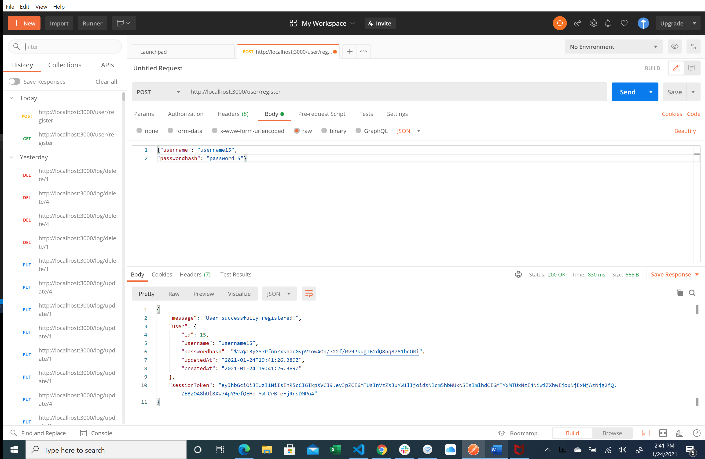
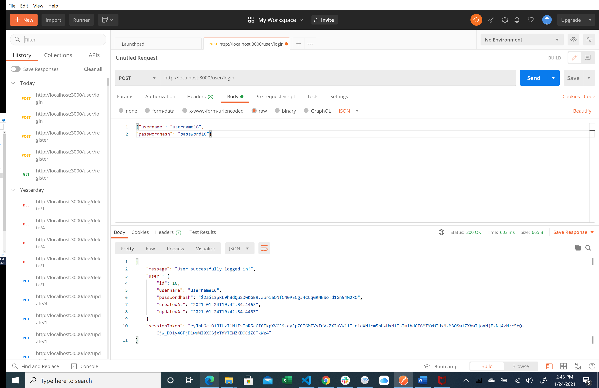
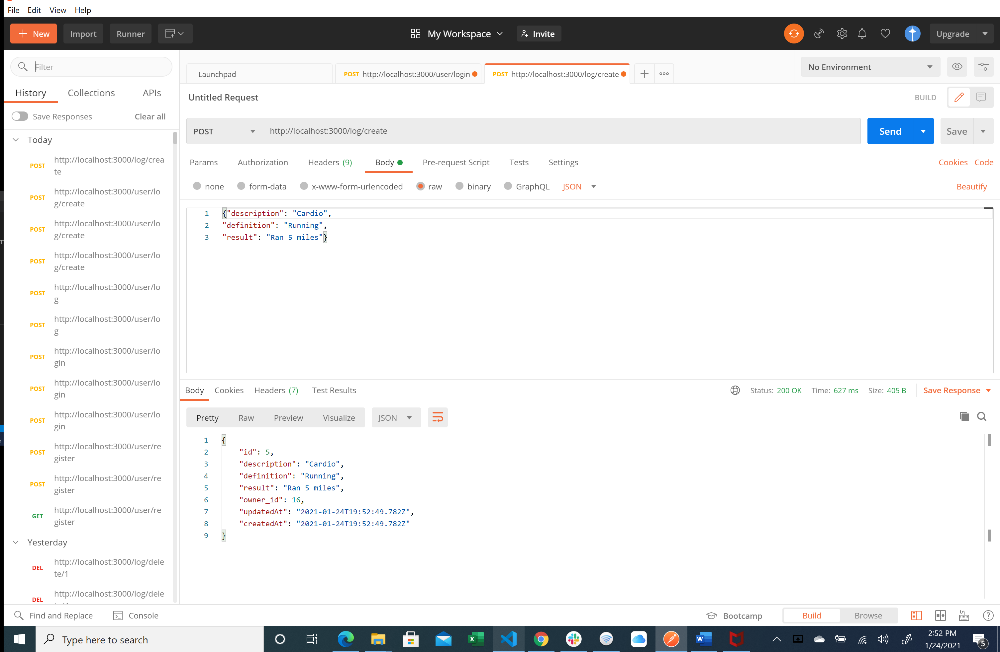
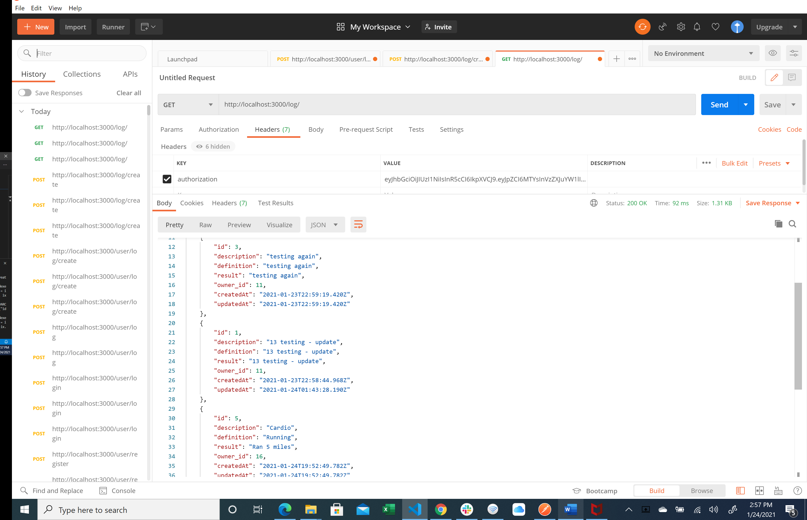
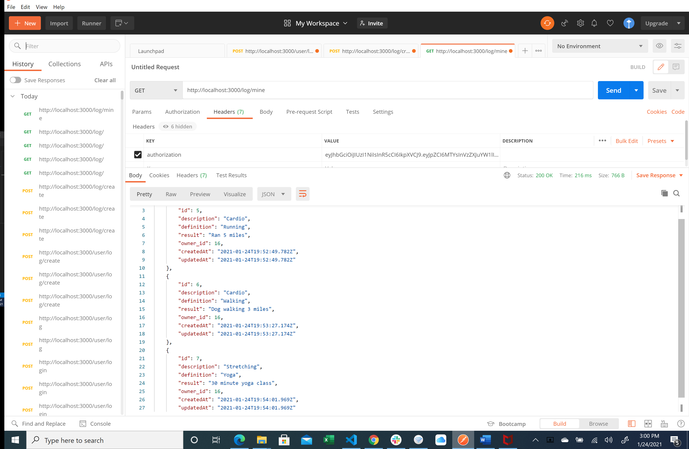
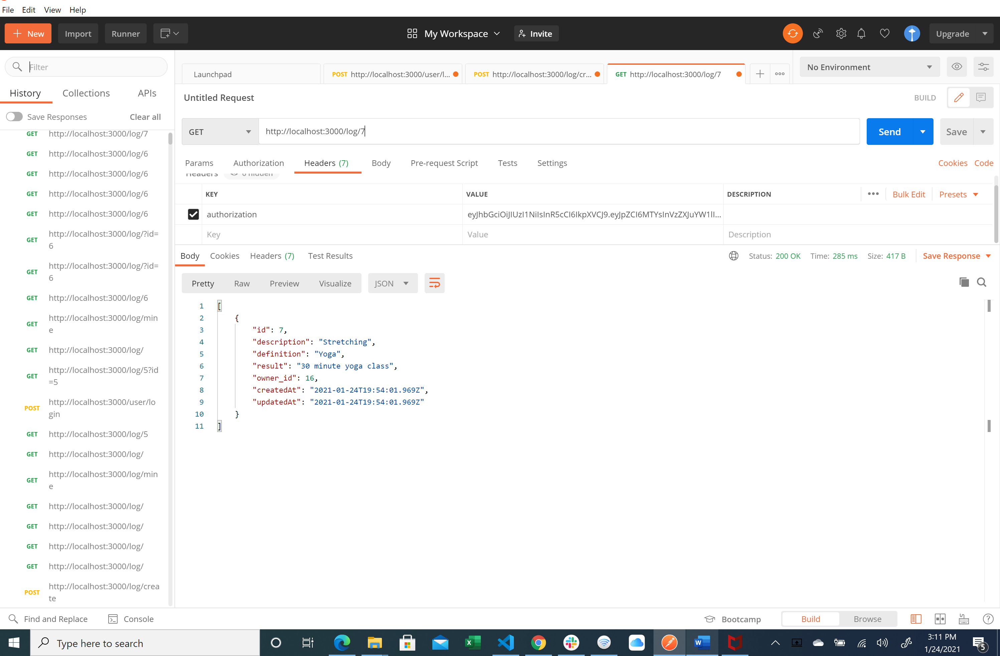
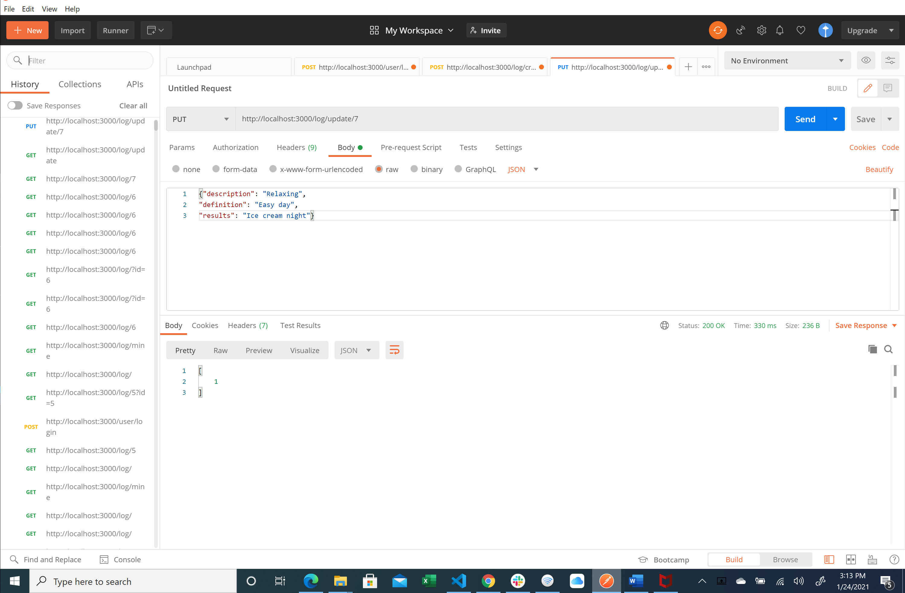
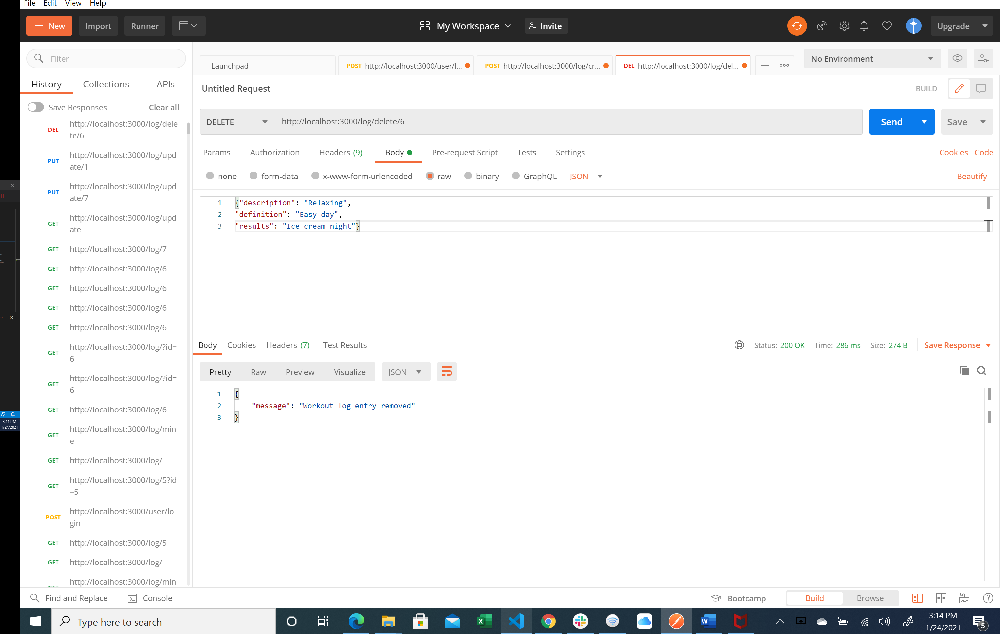
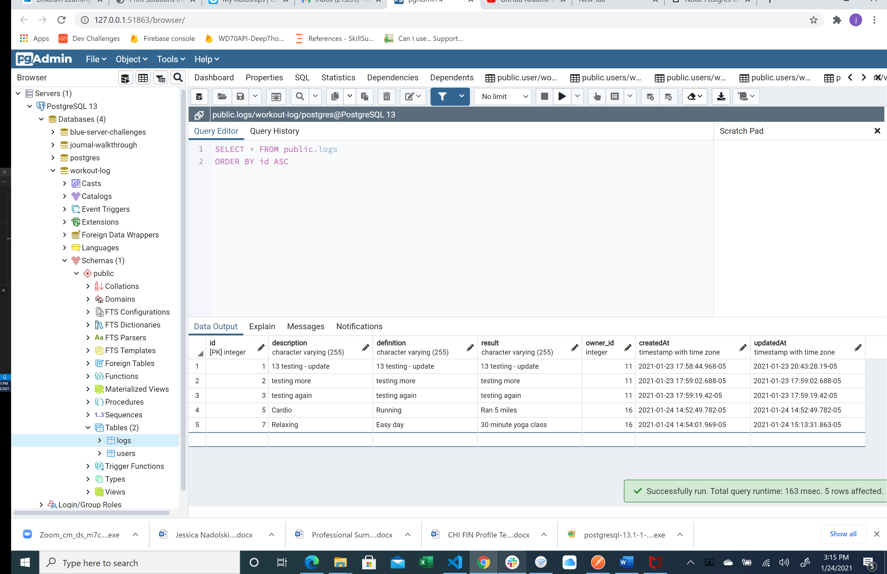

# workoutLog-server

## Endpoint:  user/register
POST - Register a new user

## Endpoint:  user/login
POST - Log in a user

## Endpoint:  log/create
POST - Create log for user logged in

## Endpoint:  log/ 
GET - Get all logs for all users

## Endpoint:  log/mine
GET - Get all logs for user logged in

## Endpoint:  log/:id
GET - Get specific log by id for user logged in

## Endpoint:  log/update/:id
PUT - Update a specific log by id for user logged in

## Endpoint:  log/delete/:id
DELETE - Delete a specific log by id for user logged in

